# Projet_MERN_MediCare_MohamedRiadhEssridi# Rapport de projet — MediCare (MERN)

## 1. Présentation

MediCare est une application web full‑stack (MERN) conçue pour faciliter la gestion des rendez‑vous médicaux, des profils patients et professionnels, des prescriptions et la communication via un chat assisté par IA. Le projet comprend un frontend React/Vite et un backend Node.js/Express qui expose une API REST connectée à une base MongoDB via Mongoose.

## 2. Objectifs

- Fournir une interface intuitive pour les patients et les professionnels.
- Gérer les comptes, profils, rendez‑vous et prescriptions.
- Proposer un module de chat/IA pour assistance et support.
- Offrir une API sécurisée avec authentification JWT.

## 3. Structure du dépôt

- backend/
  - `server.js` : point d'entrée du serveur Express.
  - `package.json` : dépendances et scripts backend.
  - `config/` : configuration (connexion DB, fichiers utilitaires).
  - `controllers/` : logique métier pour chaque ressource (user, profile, appointment, clinic, prescription, ai).
  - `models/` : schémas Mongoose (`User.js`, `Profile.js`, `Appointment.js`, `Prescription.js`, `Clinic.js`).
  - `routes/` : définitions des routes REST.
  - `middlewares/` : middlewares (authentification JWT, gestion d'erreurs).

- frontend/
  - `package.json` : dépendances frontend.
  - `src/` : code React (pages, composants, context, api).
  - `src/api/axios.js` : instance Axios configurée pour l'API.
  - `src/components/` : `Chat.jsx`, `ProtectedRoute.jsx`, `ProfessionalDashboard.jsx`, etc.

## 4. Technologies utilisées

- Frontend : React, Vite, Axios
- Backend : Node.js, Express, Mongoose
- Base de données : MongoDB (local)
- Authentification : JSON Web Tokens (JWT)

## 5. Architecture

Application en trois couches principales :
- Client SPA (React) consommant l'API REST.
- Serveur API (Express) exposant les endpoints et orchestrant la logique métier.
- Base MongoDB pour la persistance des données.

Les middleware gèrent la sécurité (vérification JWT) et la gestion centralisée des erreurs.

## 6. Modèles de données

- User
  - `email: String`
  - `password: String` (haché)
  - `role: String` ("patient" | "doctor" | "admin")

- Profile
  - `user: ObjectId` (référence User)
  - `name`, `specialty`, `phone`, `address`, etc.

- Appointment
  - `patient: ObjectId`, `professional: ObjectId`
  - `date: Date`, `status: String`, `notes: String`

- Prescription
  - `patient: ObjectId`, `prescriber: ObjectId`
  - `medicines: [{name, dosage, duration}]`, `notes`

- Clinic
  - `name`, `address`, `contact`

## 7. Diagramme de classes:

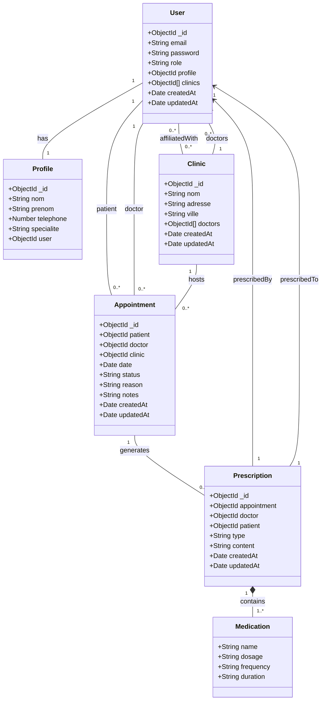

## 8. Endpoints clés (extraits)

- Auth
  - `POST /api/auth/register` - inscription
  - `POST /api/auth/login` - connexion (retourne JWT)

- Users / Profiles
  - `GET /api/users` - liste (restreint)
  - `GET /api/:userId/profile` - profil par id
  - `PUT /api/:userId/profile` - mise à jour
  - `POST /api/:userId/profile` - creation profile

- Appointments
  - `GET /api/appointments` - lister
  - `POST /api/appointments` - créer
  - `PUT /api/appointments/:id` - modifier
  - `DELETE /api/appointments/:id` - supprimer

- Clinics
  - `GET /api/clinics` - lister
  - `POST /api/clinics` - créer
  - `PUT /api/clinics/:id` - modifier
  - `DELETE /api/clinics/:id` - supprimer

- Prescriptions
  - `GET /api/prescriptions`
  - `POST /api/prescriptions`

- AI Chat
  - `POST /api/ai/chat` - envoyer message (génération de réponse)

(Consultez les fichiers `backend/routes/*.js` et `backend/controllers/*.js` pour la liste complète.)

## 9. Sécurité

- Utilisation de JWT pour protéger les routes sensibles via le middleware `authMiddleware`.
- Ne pas exposer le fichier `.env` dans le dépôt public.
- Validation des entrées côté serveur recommandée (ex. `express-validator`).

## 10. Installation et exécution (local)

1. Backend

```bash
cd backend
npm install
# créer un fichier .env avec MONGO_DB_URL, JWT_SECRET, GEMINI_API_KEY
npm run dev # ou node server.js
```

2. Frontend

```bash
cd frontend
npm install
npm run dev
```

3. Tester
- Ouvrir l'URL indiquée par Vite pour le frontend.
- Vérifier que les requêtes API pointent vers l'URL du backend (config dans `src/api/axios.js`).

## 11. Tests et validation

- Vérifier manuellement les scénarios principaux :
  - Inscription et connexion
  - Création et consultation de rendez‑vous
  - Création et consultation de prescriptions
  - Chat IA

## 12. Réalisation
- Captures des interfaces:
    - Landing page:
    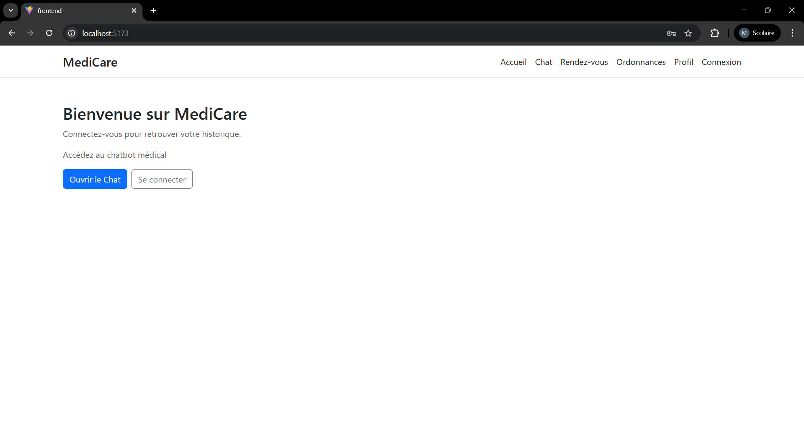

    - Login:
    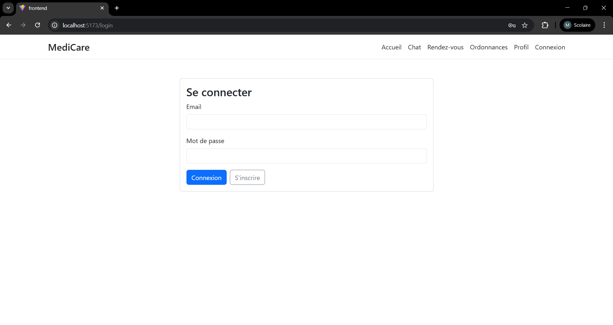

    - Register:
    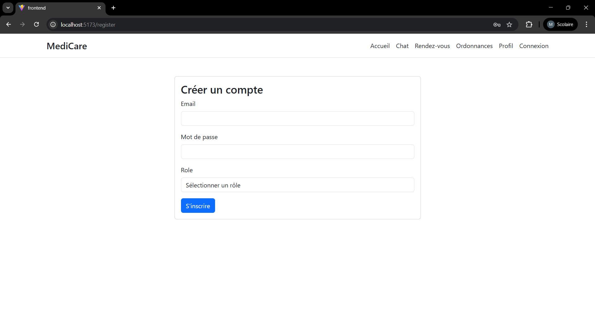

    - admin get users:
    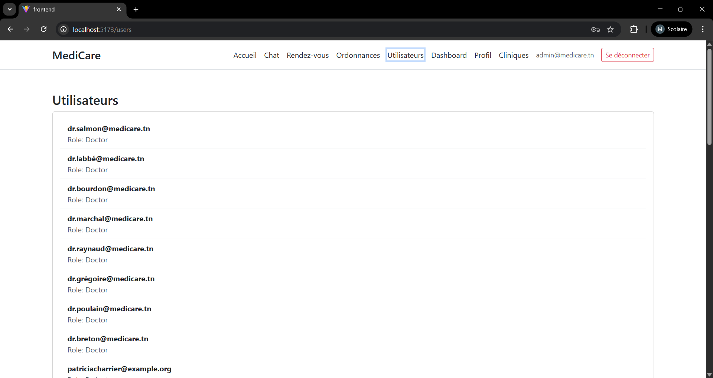

    - admin get clinics:
    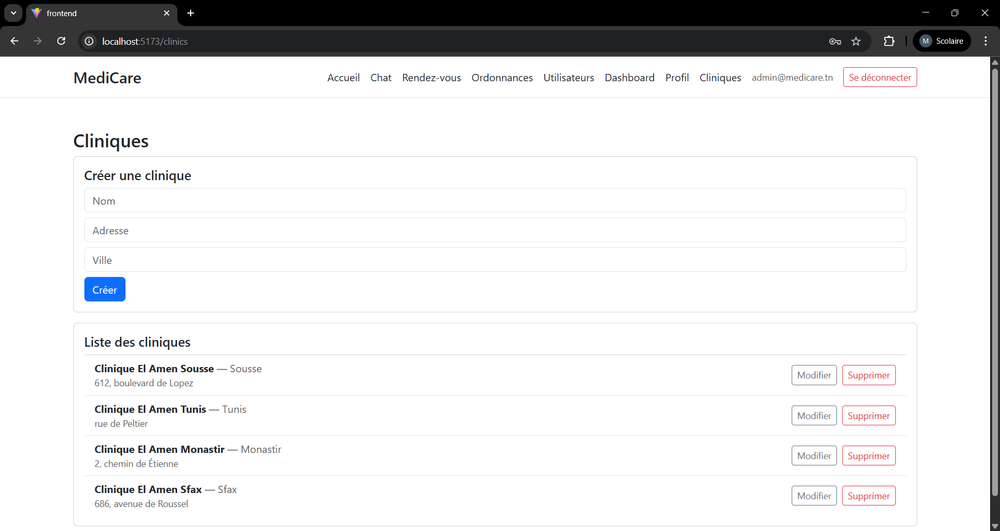

    - Dashboard BI:
    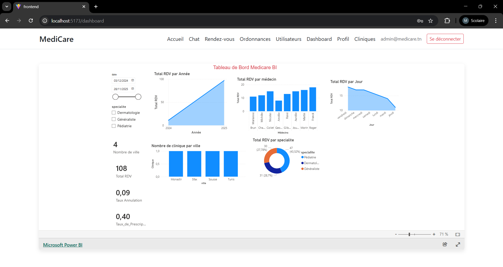

    - Profile:
    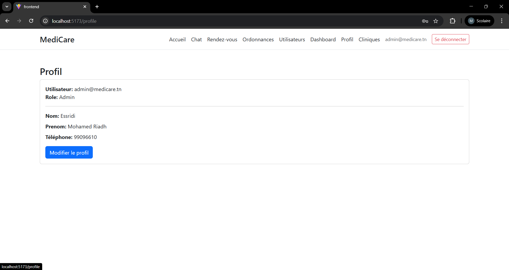

    - Doctor get appointments:
    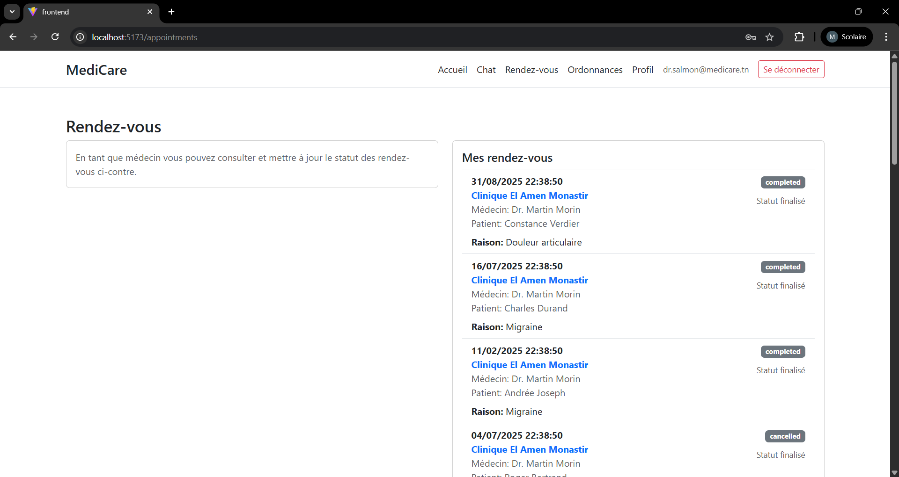

    - Doctor get prescriptions:
    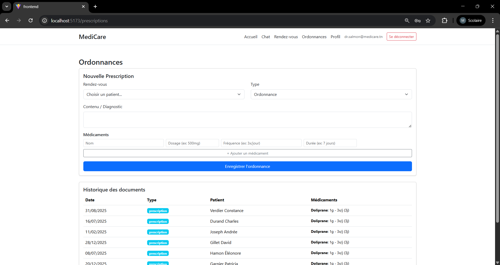

    - Doctor profile:
    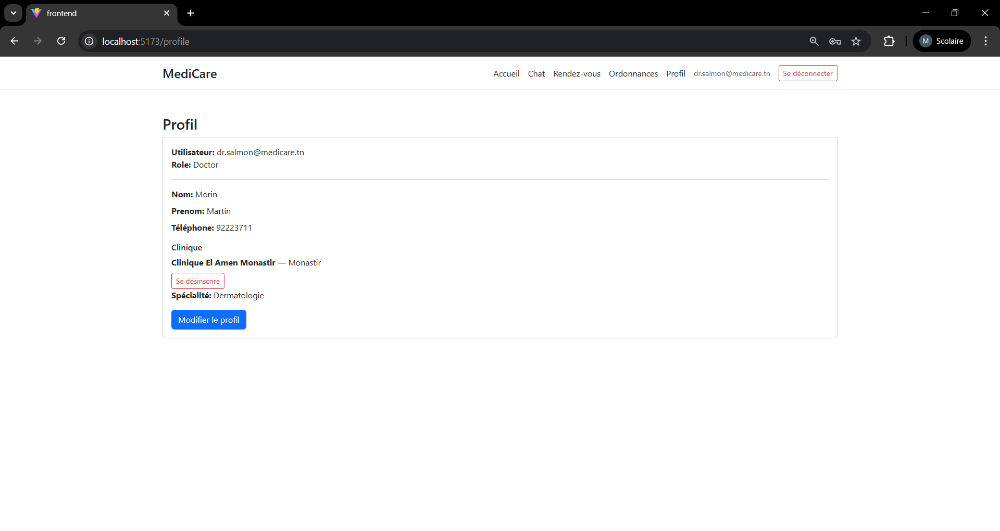

    - Patient appointment:
    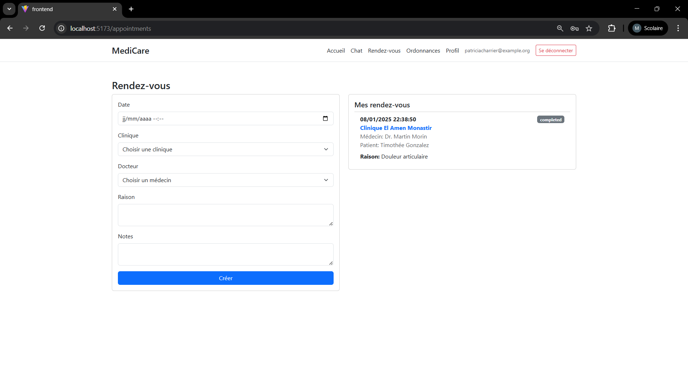

    - Patient prescription:
    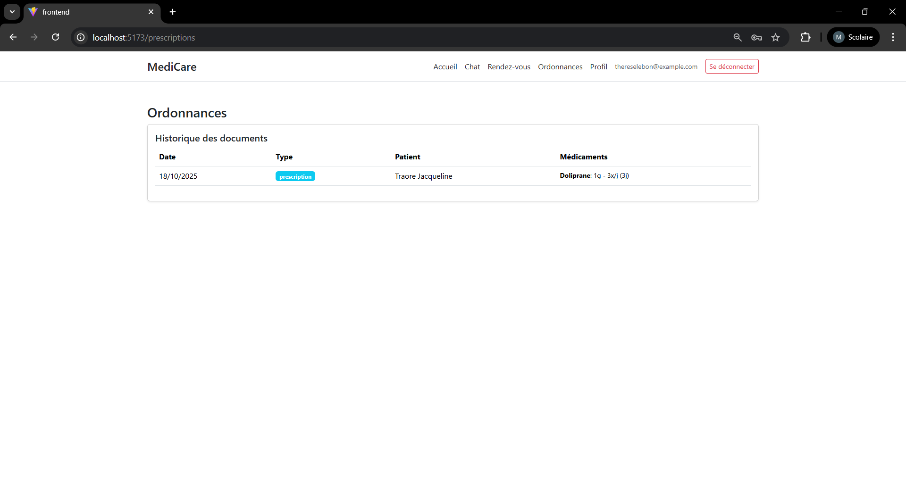

    - AI Chatbot:
    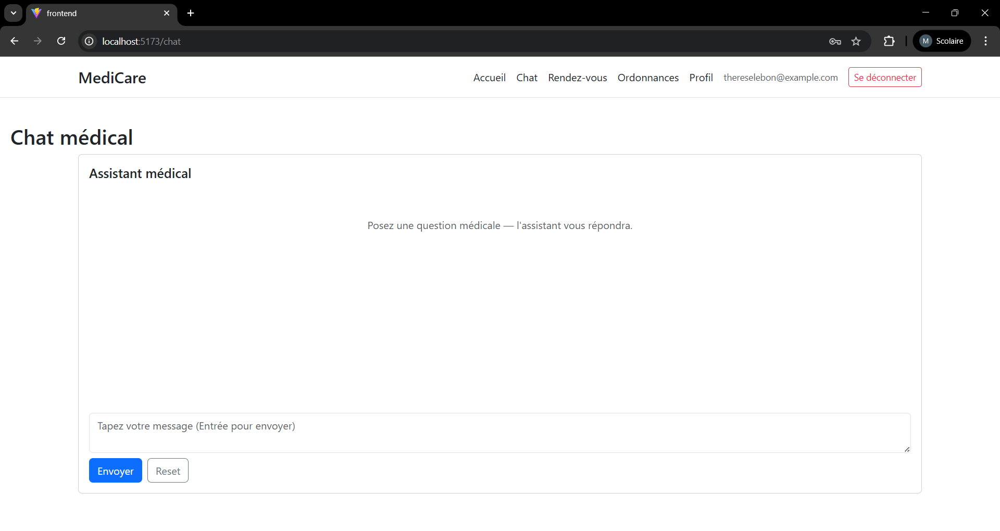


## 13.Fichiers importants :
  - [backend/server.js](backend/server.js)
  - [backend/config/db.js](backend/config/db.js)
  - [backend/controllers/userController.js](backend/controllers/userController.js)
  - [frontend/src/App.jsx](frontend/src/App.jsx)
  - [frontend/src/api/axios.js](frontend/src/api/axios.js)


**Auteur**: Mohamed Riadh Essridi
**Date**: Janvier 2026